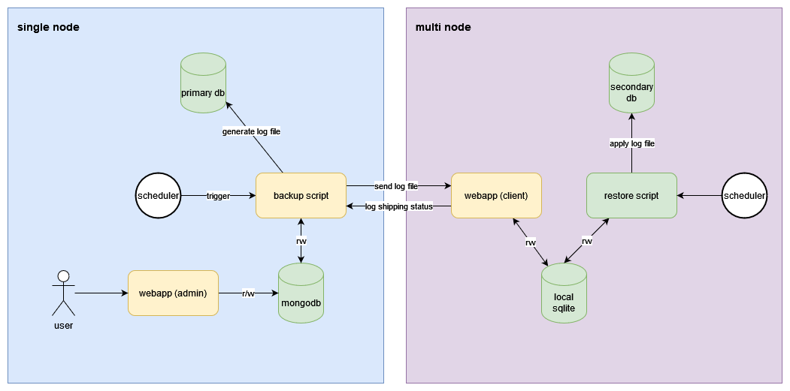

# RC Custom Log Shipping

## Deskripsi

Repositori ini berisi dokumentasi pemasangan aplikasi custom log shipping untuk SQL Server 2019 Express edition. Terdapat tiga komponen dari aplikasi ini.

### [tbd-backup-script](https://github.com/rochimfn/tbd-backup-script)

`tbd-backup-script` dipasang pada primary node. Program ini berisi script yang akan melakukan backup log dari database pada primary nodes. Program ini juga bertugas mengirimkan file log dan mengambil status restore dari log. Program ini mencatat konfigurasi dan aktivitas pada database mongodb.

### [tbd-server-webserver](https://github.com/rochimfn/tbd-server-webserver)

`tbd-server-webserver` dapat dipasang dimana saja asalkan dapat mengakses server mongodb yang mencatat konfigurasi dan aktivitas dari `tbd-backup-script`. Aplikasi web ini dapat digunakan untuk konfigurasi dan monitoring jalannya log shipping.

### [tbd-client-webserver](https://github.com/rochimfn/tbd-client-webserver)

`tbd-client-webserver` dipasang pada secondary node. Program ini berisi dua aplikasi yaitu web api yang berperan menerima kiriman log dari `tbd-backup-script` dan script restore yang berperan me-restore log yang telah dikirim. 

## Arsitektur



* Primary node hanya boleh ada satu.
* Secondary node boleh lebih dari satu node.

## Pemasangan

**Prerequisites primary node:**
* [Git](https://git-scm.com/downloads)
* [NodeJs](https://nodejs.org/en/download/) versi v14 atau lebih tinggi
* [Yarn](https://classic.yarnpkg.com/lang/en/docs/install/) versi 1.22
* [MongoDB](https://www.mongodb.com/try/download/community) versi 5.0.3
* [SQL Server](https://www.microsoft.com/en-us/sql-server/sql-server-downloads) versi 2019 Express edition

**Prerequisites secondary node:**
* [Git](https://git-scm.com/downloads)
* [NodeJs](https://nodejs.org/en/download/) versi v14 atau lebih tinggi
* [Yarn](https://classic.yarnpkg.com/lang/en/docs/install/) versi 1.22
* [SQL Server](https://www.microsoft.com/en-us/sql-server/sql-server-downloads) versi 2019 Express edition


### [tbd-backup-script](https://github.com/rochimfn/tbd-backup-script) (Primary Node)

Panduan lengkap pemasangan dapat dibaca [disini](https://github.com/rochimfn/tbd-backup-script#readme)

1. Salin repositori

```bash
git clone https://github.com/rochimfn/tbd-backup-script.git
```

2. Masuk ke direktori

```bash
cd tbd-backup-script
```

3. Pasang dependensi

```bash
yarn 
```

4. Konfigurasi `.env`

```bash
cp .env.example .env #bash atau powershell
copy .env.example .env #cmd
```

### [tbd-server-webserver](https://github.com/rochimfn/tbd-server-webserver) (Primary Node)

Panduan lengkap pemasangan dapat dibaca [disini](https://github.com/rochimfn/tbd-server-webserver#readme)

1. Salin repositori

```bash
git clone https://github.com/rochimfn/tbd-server-webserver.git
```

2. Masuk ke direktori

```bash
cd tbd-server-webserver
```

3. Pasang dependensi

```bash
yarn 
```

4. Konfigurasi `.env`

```bash
cp .env.example .env #bash atau powershell
copy .env.example .env #cmd
```

### [tbd-client-webserver](https://github.com/rochimfn/tbd-client-webserver) (Secondary Node)

Panduan lengkap pemasangan dapat dibaca [disini](https://github.com/rochimfn/tbd-client-webserver#readme)

1. Salin repositori

```bash
git clone https://github.com/rochimfn/tbd-client-webserver.git
```

2. Masuk ke direktori

```bash
cd tbd-client-webserver
```

3. Pasang dependensi

```bash
yarn 
```

4. Konfigurasi `.env`

```bash
cp .env.example .env #bash atau powershell
copy .env.example .env #cmd
```


## Konfigurasi Program

### [tbd-backup-script](https://github.com/rochimfn/tbd-backup-script) (Primary Node)

Isi berkas `.env` dengan kredensial mongodb. Contohnya sebagai berikut:

```env
MONGO_HOST='127.0.0.1'
MONGO_PORT='27017'
MONGO_DATABASE='log_shipping'
MONGO_USERNAME='admin'
MONGO_PASSWORD='password'
```
> Konfigurasi mongodb wajib sama dengan [web monitor](https://github.com/rochimfn/tbd-server-webserver)

### [tbd-server-webserver](https://github.com/rochimfn/tbd-server-webserver) (Primary Node)

Isi berkas `.env` dengan kredensial mongodb dan token (random string). Contohnya sebagai berikut:

```env
MONGO_HOST='127.0.0.1'
MONGO_PORT='27017'
MONGO_DATABASE='log_shipping'
MONGO_USERNAME='admin'
MONGO_PASSWORD='password'
TOKEN='vmouwqhlkdjf0f29u0fh2vs'
```

> Konfigurasi mongodb wajib sama dengan [backup script](https://github.com/rochimfn/tbd-backup-script)

Jalankan perintah berikut untuk mendaftarkan admin untuk web monitor:

```
yarn setup
```

Pengguna default:
  * Nama Lengkap: `Rochim Farul Noviyan`
  * Email: `rochim.noviyan@gmail.com`
  * Password: `password`

Akun pengguna dapat disesuaikan didalam pengaturan profile.

### [tbd-client-webserver](https://github.com/rochimfn/tbd-client-webserver) (Secondary Node)

Isi berkas `.env` dengan kredensial sqlserver. Contohnya sebagai berikut:

```env
PASSWORD='password'
TOKEN='qwertyuiopasdfghjklzxcvbnm123456'
MSSQL_HOST='127.0.0.1'
MSSQL_PORT=1432
MSSQL_USERNAME='admin'
MSSQL_PASSWORD='password'
DIR_BACKUP='C:\rc_backup_client\'
```

> Pastikan SQL Server dan aplikasi ini memiliki akses baca tulis direktori `DIR_BACKUP`

Jalankan perintah berikut untuk mendaftarkan akun untuk backup script

```
yarn setup
```

Pengguna default:
  * Email: `rochim.noviyan@gmail.com`
  * Password: `password` (atau menyesuaikan nilai konfigurasi `PASSWORD` pada `.env`)