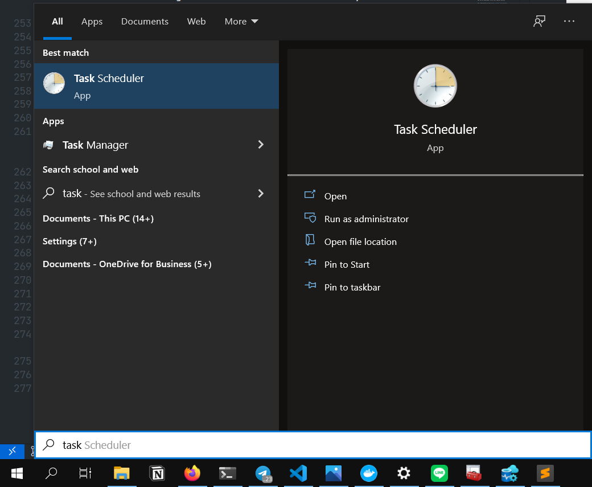
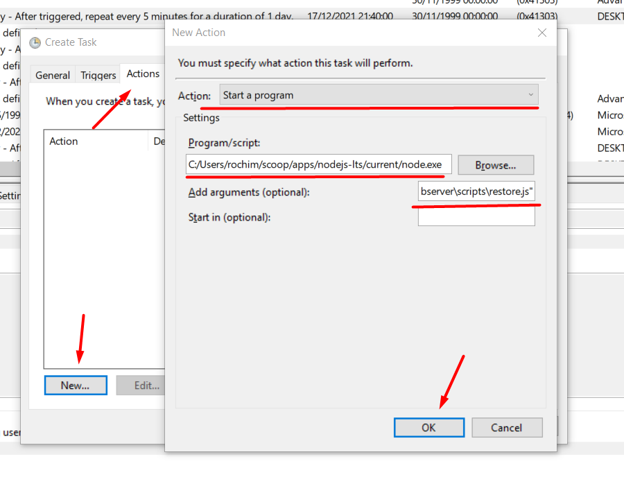

# RC Custom Log Shipping

## Deskripsi

Repositori ini berisi dokumentasi pemasangan aplikasi custom log shipping untuk SQL Server 2019 Express edition. Terdapat tiga komponen dari aplikasi ini.

### [tbd-backup-script](https://github.com/rochimfn/tbd-backup-script)

`tbd-backup-script` dipasang pada primary node. Program ini berisi script yang akan melakukan backup log dari database pada primary nodes. Program ini juga bertugas mengirimkan file log dan mengambil status restore dari log. Program ini mencatat konfigurasi dan aktivitas pada database mongodb.

### [tbd-server-webserver](https://github.com/rochimfn/tbd-server-webserver)

`tbd-server-webserver` dapat dipasang dimana saja asalkan dapat mengakses server mongodb yang mencatat konfigurasi dan aktivitas dari `tbd-backup-script`. Aplikasi web ini dapat digunakan untuk konfigurasi dan monitoring jalannya log shipping.

### [tbd-client-webserver](https://github.com/rochimfn/tbd-client-webserver)

`tbd-client-webserver` dipasang pada secondary node. Program ini berisi dua aplikasi yaitu web api yang berperan menerima kiriman log dari `tbd-backup-script` dan script restore yang berperan me-restore log yang telah dikirim. 

## Arsitektur


* Primary node hanya boleh ada satu.
* Secondary node boleh lebih dari satu node.

## Pemasangan

**Prerequisites primary node:**
* [Git](https://git-scm.com/downloads)
* [NodeJs](https://nodejs.org/en/download/) versi v14 atau lebih tinggi
* [Yarn](https://classic.yarnpkg.com/lang/en/docs/install/) versi 1.22
* [MongoDB](https://www.mongodb.com/try/download/community) versi 5.0.3
* [SQL Server](https://www.microsoft.com/en-us/sql-server/sql-server-downloads) versi 2019 Express edition

**Prerequisites secondary node:**
* [Git](https://git-scm.com/downloads)
* [NodeJs](https://nodejs.org/en/download/) versi v14 atau lebih tinggi
* [Yarn](https://classic.yarnpkg.com/lang/en/docs/install/) versi 1.22
* [SQL Server](https://www.microsoft.com/en-us/sql-server/sql-server-downloads) versi 2019 Express edition


### [tbd-backup-script](https://github.com/rochimfn/tbd-backup-script) (Primary Node)

Panduan lengkap pemasangan dapat dibaca [disini](https://github.com/rochimfn/tbd-backup-script#readme)

1. Salin repositori

```bash
git clone https://github.com/rochimfn/tbd-backup-script.git
```

2. Masuk ke direktori

```bash
cd tbd-backup-script
```

3. Pasang dependensi

```bash
yarn 
```

4. Konfigurasi `.env`

```bash
cp .env.example .env #bash atau powershell
copy .env.example .env #cmd
```

### [tbd-server-webserver](https://github.com/rochimfn/tbd-server-webserver) (Primary Node)

Panduan lengkap pemasangan dapat dibaca [disini](https://github.com/rochimfn/tbd-server-webserver#readme)

1. Salin repositori

```bash
git clone https://github.com/rochimfn/tbd-server-webserver.git
```

2. Masuk ke direktori

```bash
cd tbd-server-webserver
```

3. Pasang dependensi

```bash
yarn 
```

4. Konfigurasi `.env`

```bash
cp .env.example .env #bash atau powershell
copy .env.example .env #cmd
```

### [tbd-client-webserver](https://github.com/rochimfn/tbd-client-webserver) (Secondary Node)

Panduan lengkap pemasangan dapat dibaca [disini](https://github.com/rochimfn/tbd-client-webserver#readme)

1. Salin repositori

```bash
git clone https://github.com/rochimfn/tbd-client-webserver.git
```

2. Masuk ke direktori

```bash
cd tbd-client-webserver
```

3. Pasang dependensi

```bash
yarn 
```

4. Konfigurasi `.env`

```bash
cp .env.example .env #bash atau powershell
copy .env.example .env #cmd
```


## Konfigurasi Program

### [tbd-backup-script](https://github.com/rochimfn/tbd-backup-script) (Primary Node)

Isi berkas `.env` dengan kredensial mongodb. Contohnya sebagai berikut:

```env
MONGO_HOST='127.0.0.1'
MONGO_PORT='27017'
MONGO_DATABASE='log_shipping'
MONGO_USERNAME='admin'
MONGO_PASSWORD='password'
```
> Konfigurasi mongodb wajib sama dengan [web monitor](https://github.com/rochimfn/tbd-server-webserver)

### [tbd-server-webserver](https://github.com/rochimfn/tbd-server-webserver) (Primary Node)

Isi berkas `.env` dengan kredensial mongodb dan token (random string). Contohnya sebagai berikut:

```env
MONGO_HOST='127.0.0.1'
MONGO_PORT='27017'
MONGO_DATABASE='log_shipping'
MONGO_USERNAME='admin'
MONGO_PASSWORD='password'
TOKEN='vmouwqhlkdjf0f29u0fh2vs'
```

> Konfigurasi mongodb wajib sama dengan [backup script](https://github.com/rochimfn/tbd-backup-script)

Jalankan perintah berikut untuk mendaftarkan admin untuk web monitor:

```
yarn setup
```

Pengguna default:
  * Nama Lengkap: `Rochim Farul Noviyan`
  * Email: `rochim.noviyan@gmail.com`
  * Password: `password`

Akun pengguna dapat disesuaikan didalam pengaturan profile.

### [tbd-client-webserver](https://github.com/rochimfn/tbd-client-webserver) (Secondary Node)

Isi berkas `.env` dengan kredensial sqlserver. Contohnya sebagai berikut:

```env
PASSWORD='password'
TOKEN='qwertyuiopasdfghjklzxcvbnm123456'
MSSQL_HOST='127.0.0.1'
MSSQL_PORT=1432
MSSQL_USERNAME='admin'
MSSQL_PASSWORD='password'
DIR_BACKUP='C:\rc_backup_client\'
```

> Pastikan SQL Server dan aplikasi ini memiliki akses baca tulis direktori `DIR_BACKUP`

Jalankan perintah berikut untuk mendaftarkan akun untuk backup script

```
yarn setup
```

Pengguna default:
  * Email: `rochim.noviyan@gmail.com`
  * Password: `password` (atau menyesuaikan nilai konfigurasi `PASSWORD` pada `.env`)


## Konfigurasi Node

> Pastikan telah menjalankan pemasangan dan konfigurasi program!

Syarat dari `log shipping` adalah secondary db merupakan hasil restore dari primary db. Jika secondary db belum tersedia silahkan persiapkan dulu. Berikut adalah contoh persiapan:

* Backup database 

```sql
BACKUP DATABASE [programming-in-db] TO DISK = N'C:\rc_backup\programming-in-db.bak'
```

* Pindah berkas backup (`programming-in-db.bak`) ke secondary node

* Restore database

```sql
RESTORE DATABASE [programming-in-db] FROM DISK = N'C:\rc_backup_client\programming-in-db.bak'
WITH MOVE 'programming-in-db' TO 'C:\Program Files\Microsoft SQL Server\MSSQL15.SQLEXPRESS1\MSSQL\DATA\programming-in-db.mdf',
MOVE 'programming-in-db_log' TO 'C:\Program Files\Microsoft SQL Server\MSSQL15.SQLEXPRESS1\MSSQL\DATA\programming-in-db_log.ldf',
STANDBY= 'C:\Program Files\Microsoft SQL Server\MSSQL15.SQLEXPRESS1\MSSQL\DATA\programming-in-db_standby.bak', REPLACE;
```

* Secondary db siap menerima merestore log

### Jalankan web monitor (tbd-server-webserver)

```bash
cd tbd-server-webserver
yarn start
```
### Masuk ke web monitor
*  Buka [http://localhost:5000](http://localhost:5000) (atau sesuai ip server)

    * email: `rochim.noviyan@gmail.com` 
    * password: `password`

### Konfigurasi primary node


* Buka halaman "Primary Node"
* Tekan tombol "EDIT"
* Sesuaikan isian dengan kredensial primary node
* Tekan tombol "SIMPAN"

### Konfigurasi secondary node


* Buka halaman "Secondary Nodes"
* Tekan tombol "TAMBAH"
* Sesuaikan isian dengan kredensial client secondary (tbd-client-webserver)
  * default port: `3000`
  * default email: `rochim.noviyan@gmail.com`
  * default password: `password`
* Tekan tombol "TAMBAH"


## Konfigurasi Jalan Otomatis

Bagian ini hanya menjelaskan penjadwalan di windows. Penjadwalan di linux dapat mengikuti [panduan ini](https://stackoverflow.com/a/57302109).


### Menjalankan `tbd-client-webserver` sebagai daemon

```
yarn global add pm2
cd tbd-client-webserver
pm2 start src/index.js --name "rc-client"
```

### Mendaftarkan `tbd-backup-script` ke Task Scheduler

Buka program `Task Scheduler`. Pada start menu ada di Windows Administrative Tools. Atau gunakan pencarian.



Pada sidebar bagian kanan, pilih menu "Create Task" dan jendela Create Task akan muncul.


Pada tab General sesuaikan nilai "Name" dengan nama yang diinginkan, misalkan saja "backup-script". Lalu pada bagian bawah disarankan memilih "Run whether user is logged on or not". Berpindah ke tab Triggers.


Tekan tombol "New...", pada jendela yang muncul sesuaikan kapan backup script akan berjalan. Misalkan disini script akan berjalan secara "Daily" (harian) dimulai pada tanggal 17/12/2021 jam 21:40. Script akan di jalankan lagi setiap 5 menit setelah eksekusi. Tekan "OK" untuk menyimpan. Berpinah ke tab "Actions".


Tekan tombol "New...", pada jendela yang muncul pastikan Start a program terpilih pada bagian Action. Pada bagian Program/script arahkan ke executable nodejs. Lalu pada bagian Add arguments (optional) isi dengan lokasi `script.js` dari backup-script dan tambahkan argumen `log` dibelakang. Misalkan seperti berikut:

```bash
"C:\Users\rochim\Projects\fp-tbd\backup-script\script.js" log
```

Berpindah ke tab Conditions


(Opsional) Hilangkan centang pada "Start the task only if the computer is on AC power" agar script dapat berjalan ketika perangkat sedang tidak di charge (misal menggunakan laptop).

Tekan "OK" untuk menyimpan!


Pastikan task terdaftar dengan menekan "Task Scheduler Library" pada sidebar bagian kiri.


### Mendaftarkan `tbd-client-webserver` ke Task Scheduler

Buka program `Task Scheduler`. Pada start menu ada di Windows Administrative Tools. Atau gunakan pencarian.


Pada sidebar bagian kanan, pilih menu "Create Task" dan jendela Create Task akan muncul.


Pada tab General sesuaikan nilai "Name" dengan nama yang diinginkan, misalkan saja "restore-script". Lalu pada bagian bawah disarankan memilih "Run whether user is logged on or not". Berpindah ke tab Triggers.


Tekan tombol "New...", pada jendela yang muncul sesuaikan kapan backup script akan berjalan. Misalkan disini script akan berjalan secara "Daily" (harian) dimulai pada tanggal 17/12/2021 jam 21:50. Script akan di jalankan lagi setiap 5 menit setelah eksekusi. Tekan "OK" untuk menyimpan. Berpinah ke tab "Actions".



Tekan tombol "New...", pada jendela yang muncul pastikan Start a program terpilih pada bagian Action. Pada bagian Program/script arahkan ke executable nodejs. Lalu pada bagian Add arguments (optional) isi dengan lokasi `restore.js` dari backup-script dan tambahkan argumen `log` dibelakang. Misalkan seperti berikut:

```bash
"C:\Users\rochim\Projects\fp-tbd\client-webserver\scripts\restore.js"
```

Berpindah ke tab Conditions


(Opsional) Hilangkan centang pada "Start the task only if the computer is on AC power" agar script dapat berjalan ketika perangkat sedang tidak di charge (misal menggunakan laptop).

Tekan "OK" untuk menyimpan!


Pastikan task terdaftar dengan menekan "Task Scheduler Library" pada sidebar bagian kiri.


### Memantu jalannya backup dengan `tbd-server-webserver`

```bash
cd tbd-server-webserver
yarn start
```

Web monitor dapat diakses diport 5000